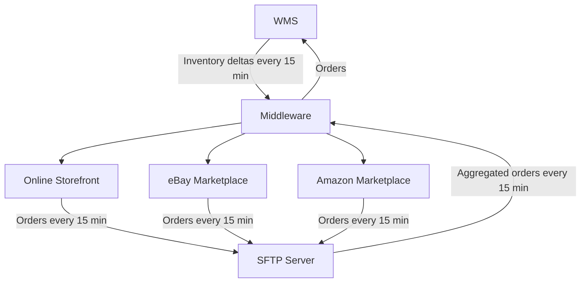
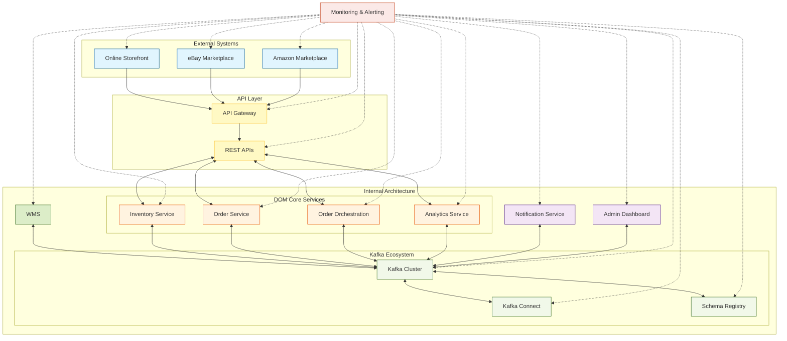

## Note: Please install Mermaid Extension for looking at the Diagrams. 

# Order Management System Analysis and Improved Architecture

## Current State Analysis

The current system architecture consists of the following components:

- Warehouse Management System (WMS)
- Online Storefront
- eBay Marketplace
- Amazon Marketplace
- Middleware System
- SFTP Server

### Key Characteristics:

1. Single inventory pool in WMS
2. Inventory updates every 15 minutes
3. Orders exported in batches every 15 minutes
4. Orders aggregated and posted to WMS every 15 minutes

### Current State Diagram

### Causes of Overselling

1. Delayed inventory updates
2. Batch processing of orders
3. Lack of real-time inventory tracking
4. No inventory reservation system

#### Quick Wins:
1. Increase update frequency: Reduce the interval for inventory updates and order processing from 15 minutes to 5 minutes or less.
2. Implement safety stock: Keep a buffer stock for each product to account for potential discrepancies.
3. Prioritize high-demand items: Implement more frequent updates for fast-moving products.

## Proposed DOM Architecture with Kafka

To address the overselling issues and improve overall system performance, we propose a new architecture based on a Distributed Order Management (DOM) system using Kafka as the central message bus.

### Enhanced DOM Architecture Diagram

### Key Components:

1. **REST Services:**
    - Design RESTful APIs that encapsulate all necessary operations for external systems.
2. **Kafka Ecosystem:**
    - Kafka Cluster: Central message bus for all event streaming
    - Kafka Connect: Facilitates integration with external systems

2. **DOM Core Services:**
    - Inventory Service: Manages real-time inventory state
    - Order Service: Handles order lifecycle
    - Order Orchestration: Implements routing and fulfillment logic
    - Analytics Service: Processes events for insights and reporting

3. **Support Services:**
    - Notification Service: Handles alerts and updates
    - API Gateway: Provides a unified interface for external systems

4. **Monitoring & Management:**
    - Admin Dashboard: For configuration and monitoring
    - Monitoring & Alerting: Oversees system health and performance

### Benefits of the New Architecture:

1. Real-time processing: Enables immediate reactions to inventory changes and orders
2. Scalability: Each component can be scaled independently as needed
3. Resilience: Kafka's durability ensures data integrity even if individual services fail
4. Flexibility: Easy to add new services or modify existing ones
5. Observability: Centralized monitoring and management

This architecture addresses the overselling problem by enabling real-time inventory updates and order processing across all channels, while also providing a foundation for future growth and additional features.
